<picture>
  <source media="(prefers-color-scheme: dark)" srcset="assets/banner.svg">
  <source media="(prefers-color-scheme: light)" srcset="assets/banner-light.svg">
  
</picture>

 

  

 

## 🚀 About Me

I'm a front-end engineer who cares about the last 5% almost as much as the first 95%, the easing curve, the focus ring, the loading state nobody notices until it's missing. I build clean, fast, accessible interfaces and I genuinely enjoy the craft of it.

> *"I don't code software, I code emotions."*

- 🎨 Turning designs into pixel-accurate, responsive UI
- ⚛️ Building with React, component systems, and clean state management
- 🌱 Always learning the next thing the front-end world throws at me
- 💬 Ask me about performance, accessibility, or why that div won't center

 

## 🛠️ Tech Stack

 

## 📊 GitHub Stats

 

All three cards above are static local SVGs rendered straight from this repo, no third-party rate-limited card services involved.

 

## 📈 Contribution Activity

Live graph from a hosted renderer, this one needs to stay dynamic since it reflects today's contributions.

 

## 🐍 Contribution Snake

<picture>
  <source media="(prefers-color-scheme: dark)" srcset="https://raw.githubusercontent.com/SameerNurhaj/SameerNurhaj/output/github-snake-dark.svg">
  <source media="(prefers-color-scheme: light)" srcset="https://raw.githubusercontent.com/SameerNurhaj/SameerNurhaj/output/github-snake.svg">
  
</picture>

Generated on a schedule by <code>.github/workflows/github-snake.yml</code> via the Platane/snk action, committed to the <code>output</code> branch.

 

## 💼 Featured Projects

| Project | Stack | Description |
|---|---|---|
| **[Portfolio Site](https://sameeransari.com.np)** | React · Tailwind · Vite | Personal portfolio with motion-driven case studies. |
| **[Birthday wish](https://specialbtd.netlify.app/)** | TypeScript · React · Node js |An interactive birthday website with animations, music, countdowns, and personalized memories. |
| **[Text analyzer](https://sn-text.netlify.app/)** | HTML5 · CSS3 · Javascript|A web-based text analyzer that provides useful insights and statistics from user-provided text. |
| **[qr-code generator](https://sameernurhaj.github.io/QR-Generator/)** | HTML5 · CSS3 · JavaScript |A simple QR code generator that converts text or URLs into downloadable QR codes using a clean, responsive interface. |

 

## 📫 Let's Connect

 

⭐️ Always learning, always building. Thanks for stopping by!

